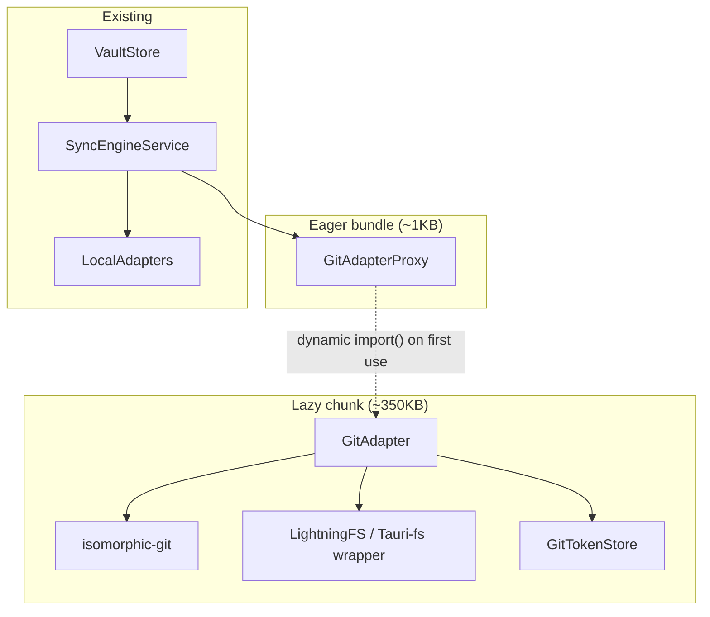

## Plan: Git Protocol Cloud Adapter (REVISED)

**TL;DR** — Build a lazy-loaded `GitAdapter` implementing the `Adapter` interface using **isomorphic-git** (pure TypeScript, zero Rust). Uses real filesystem on Tauri desktop, LightningFS (IndexedDB) on web. Plugs into existing multi-adapter sync model. Works with any git remote via HTTPS + PAT auth.

---

## Key Decisions (from sceptic review)

| # | Decision | Rationale |
|---|----------|-----------|
| 1 | **Lazy-loaded proxy** — register a stub `GitAdapterProxy` (~1KB) in `ADAPTERS`; real `GitAdapter` (isomorphic-git, LightningFS) loaded via dynamic `import()` on first use | 350KB dead weight never shipped to users who don't use git |
| 2 | **No `flush()`** — `write()` does full `git.add` + `git.commit` + `git.push` inline | The 1s debounce in `SyncEngineService` already collapses per-entry edits; existing error handling (throw → skip `markAdapterSynced`) works correctly without restructuring push phase |
| 3 | **Inline commit, not batch** — each write becomes one git commit | Sync engine's debounce makes multi-edit-per-cycle rare; note-taking app history is fine |
| 4 | **Registered alongside `GDriveAdapter`** — both live in `app.config.ts` as disabled/pending, gated by a TODO | Keeps DI registration in one place, easy to enable when either is ready |
| 5 | **Web Crypto mandatory** for token encryption — no "simple obfuscation" fallback | `SubtleCrypto` is available in all Tauri webviews and browsers; IndexedDB is not encrypted |
| 6 | **Visibility-aware polling** — pause `watch()` on `document.hidden`, exponential backoff (30s→1m→2m→5m→15m max) on fetch failures | Battery/bandwidth conservation on mobile (Android Tauri) |
| 7 | **`root` = `repoUrl`** — passed through from `ActiveAdapterEntry.root`, used as identity during multi-adapter operations | Git adapter ignores the filesystem path; `repoUrl` is both the identity and the authentication scope |
| 8 | **Meaningful commit messages** — e.g. `Update foo.md`, `Delete bar.md` instead of `Sync from note app` | Git history must be useful |

---

## TODOs (deferred after initial implementation)

- [ ] **GDriveAdapter** — registered in `ADAPTERS` as a no-op stub alongside `GitAdapterProxy`. Add `GDriveAdapterConfig`, `'gdrive'` to `AdapterId`, wire into discriminated union. Implement later.
- [ ] **UI: workspace wizard "Cloud" option** — currently wizard only knows local folder picking. Needs a second path for cloud adapters (git config dialog).
- [ ] **Workspace creation UX for git** — `pickWorkspaceFolder()` opens a form (repo URL, branch, PAT, author). Might live in wizard, not inside adapter.
- [ ] **Merge conflict resolution UI** — conflicts surface as `syncFailed` errors. Manual resolution (diff viewer, keep-local/keep-remote) is follow-up.

---

## Architecture Overview



---

## How Git Maps to the Adapter Interface

| Adapter Method | Git Implementation |
|---|---|
| `id = 'git'`, `isLocal = false` | Cloud adapter, excluded from folder picker lookup |
| `pickWorkspaceFolder()` | Form: repo URL, branch (default `main`), PAT, author name, author email |
| `read(path, root)` | `git.readBlob` + `git.resolveRef` from clone working tree |
| `write(path, content, root)` | Write → `git.add` → `git.commit` → `git.push` (inline, atomic per write) |
| `delete(path, root)` | `git.remove` → `git.commit` → `git.push` |
| `rename(oldPath, newPath, root)` | Write new → `git.remove` old → `git.commit` → `git.push` |
| `list(path, root, recursive)` | `git.listFiles` for flat; fs walk for recursive |
| `watch(callback, root)` | Periodic `git.fetch` + diff → `WatchEvent[]`. Pause on `document.hidden`. Exponential backoff (30s→1m→2m→5m→15m). |
| `createDir(path, root)` | Create dir + `.gitkeep` in working tree |

---

## Implementation Phases

### Phase 1: Types & Config

**1. Create `src/app/core/adapters/cloud/git-types.ts`**
- `GitFsBackend` type — discriminates Tauri fs vs LightningFS
- `GitCloneState` enum: `NOT_CLONED | CLONING | READY | ERROR`
- `GitCloneError` interface — surfaces to UI when clone fails
- `GitAuth` interface: `{ token: string; username?: string; }`

**2. Extend `adapter.interface.ts`**
- Add `GitAdapterConfig` to the discriminated union:
  ```typescript
  export interface GitAdapterConfig {
    readonly adapterId: 'git';
    repoUrl: string;
    branch: string;
    token: string;
    authorName: string;
    authorEmail: string;
    pollIntervalMs: number;
  }
  ```
- Add `'git'` and `'gdrive'` to `AdapterId` union
- Add `GitAdapterConfig` and `GDriveAdapterConfig` (stub) to `AdapterConfig` union
- NO `flush?()` — not needed (see Decision #2)

### Phase 2: Filesystem Backend

**3. Create `src/app/core/adapters/cloud/git-fs.ts`**
- `createGitFsBackend(): Promise<GitFsBackend>`
- **Tauri path**: wraps `@tauri-apps/plugin-fs` into isomorphic-git's fs interface (readFile, writeFile, mkdir, readdir, unlink, rename, stat)
- **Browser path**: instantiates `LightningFS` (IndexedDB-backed): `new FS('git-repo')`
- Auto-detected via `PlatformService` (existing in project) or browser check

### Phase 3: Token Management

**4. Create `src/app/core/adapters/cloud/git-auth.ts`**
- `GitTokenStore` class
- `getToken(repoUrl: string): Promise<string | null>`
- `setToken(repoUrl: string, token: string): Promise<void>`
- `deleteToken(repoUrl: string): Promise<void>`
- **Uses Web Crypto (`SubtleCrypto`) to encrypt before IndexedDB write** — derive AES-GCM key from device fingerprint + app salt. No "simple obfuscation" fallback.
- Provides `onAuth` callback for isomorphic-git's `git.push()` and `git.fetch()`

### Phase 4: Lazy Proxy + GitAdapter Core

**5. Create `src/app/core/adapters/cloud/git-adapter-proxy.ts`**
```typescript
export class GitAdapterProxy implements Adapter {
  readonly id = 'git';
  readonly isLocal = false;
  private real: Adapter | null = null;

  isAvailable(): boolean { return true; }

  private async ensureLoaded(): Promise<Adapter> {
    if (!this.real) {
      const { GitAdapter } = await import('./git.adapter');
      this.real = new GitAdapter();
    }
    return this.real;
  }

  async read(path: string, root?: string): Promise<string> {
    return (await this.ensureLoaded()).read(path, root);
  }
  // ... delegate all methods the same way
}
```

**6. Create `src/app/core/adapters/cloud/git.adapter.ts`** (~250 lines)

Constructor:
- Generates `cloneDir` from hashed `repoUrl`
- Creates fs backend via `createGitFsBackend()`
- Initializes `GitTokenStore`
- `cloneState: signal<GitCloneState>('NOT_CLONED')`
- `cloneError: signal<string | null>(null)`
- `lastKnownSha: string | null = null`

Key method implementations:

- **`read(path, root)`**
  ```typescript
  await this.ensureCloned();
  const oid = await git.resolveRef({ fs, dir, ref: 'HEAD' });
  const { blob } = await git.readBlob({ fs, dir, oid, filepath: path });
  return new TextDecoder().decode(blob);
  ```

- **`write(path, content, root)`** — inline commit+push, no `flush()`:
  ```typescript
  await this.ensureCloned();
  await this.fs.promises.writeFile(resolvePath(path), content);
  await git.add({ fs, dir, filepath: path });
  await git.commit({
    fs, dir, author: { name, email },
    message: `Update ${path}`,
  });
  await git.push({ fs, dir, http, remote: 'origin', ref: branch, onAuth });
  ```

- **`delete(path, root)`**
  ```typescript
  await this.ensureCloned();
  await git.remove({ fs, dir, filepath: path });
  await git.commit({ /* ... */, message: `Delete ${path}` });
  await git.push({ /* ... */ });
  ```

- **`rename(oldPath, newPath, root)`**
  ```typescript
  // isomorphic-git has no git mv → copy content then add+remove
  const content = await this.read(oldPath, root);
  await this.fs.promises.writeFile(resolvePath(newPath), content);
  await git.add({ fs, dir, filepath: newPath });
  await git.remove({ fs, dir, filepath: oldPath });
  await git.commit({ message: `Rename ${oldPath} → ${newPath}` });
  await git.push({ /* ... */ });
  ```

- **`watch(callback, root)`** — visibility-aware + exponential backoff:
  ```typescript
  let intervalMs = config.pollIntervalMs || 30_000;
  const MAX_INTERVAL = 15 * 60 * 1000; // 15 min
  let failureCount = 0;
  const poll = async () => {
    if (document.hidden) return; // pause when tab hidden
    try {
      const prevSha = this.lastKnownSha;
      const fetchResult = await git.fetch({ fs, dir, remote: 'origin' });
      failureCount = 0; // reset on success
      intervalMs = config.pollIntervalMs || 30_000;
      if (prevSha && fetchResult) {
        // diff to find changes → emit WatchEvent[]
      }
    } catch {
      failureCount++;
      intervalMs = Math.min(intervalMs * 2, MAX_INTERVAL);
    }
  };
  const timerId = setInterval(poll, intervalMs);
  // visibility change listener to resume polling
  return () => { clearInterval(timerId); };
  ```

- **`pickWorkspaceFolder()`** (for now, deferred — returns null / marks TODO)
  ```typescript
  // TODO: Wizard UX for cloud adapter config (repo URL, branch, PAT, author)
  return null;
  ```

- **`list(path, root, recursive)`**
  ```typescript
  await this.ensureCloned();
  const files = await git.listFiles({ fs, dir, ref: 'HEAD' });
  // filter by path prefix, map to FileEntry[]
  ```

- **`registerScope(root)`**: no-op
- **`isAvailable()`**: returns `true`

Private helpers:
- `ensureCloned()`: if .git missing → shallow clone (`depth: 1, singleBranch: true`)
- `resolvePath(path)`: join cloneDir + path
- `handlePushConflict()`: if push fails non-fast-forward → `git.pull` then retry; if merge conflict → throw error → sync engine catches it

### Phase 5: DI Registration

**7. Update `app.config.ts`**
```typescript
provide: ADAPTERS,
useFactory: () => {
  const adapters = [new TestFsAdapter()];
  if (isTauriRuntime()) {
    adapters.push(new TauriFsAdapter());
  } else {
    adapters.push(new BrowserFileSystemApiAdapter());
  }
  // Lazy-loaded cloud adapters
  // TODO: Enable when ready
  // adapters.push(new GitAdapterProxy());
  // adapters.push(new GDriveAdapterProxy());
  return adapters;
}
```
Both git and gdrive proxies are registered but commented out — gated by a TODO. When the workspace wizard supports cloud adapters, uncomment.

### Phase 6: Dependencies + Testing

**8. Update `package.json`**
- `"isomorphic-git": "^1.27.0"` — pure TypeScript, no native deps
- `"@isomorphic-git/lightning-fs": "^1.1.0"` — only imported on browser path

Both are only ever `import()`-ed by the proxy — zero bundle impact until first use.

**9. Unit tests for `GitAdapter`**
- Use LightningFS (works in Vitest/Node) — no real git remote
- Test `read/write/delete/rename/list` against a local clone
- Test inline commit: verify git log after write
- Test push failure → throw → no state committed
- Test watch with pause on hidden + exponential backoff timing
- Test `ensureCloned`: verify shallow clone on missing .git

**10. Integration test**
- Workspace with both `TestFsAdapter` + `GitAdapter`
- Verify entries sync to both independently
- Verify `markAdapterSynced` only fires after successful push

---

## Files Summary

### Create
- `src/app/core/adapters/cloud/git.adapter.ts` — main class (~250 lines)
- `src/app/core/adapters/cloud/git-adapter-proxy.ts` — lazy proxy (~40 lines)
- `src/app/core/adapters/cloud/git-fs.ts` — fs backend factory (~80 lines)
- `src/app/core/adapters/cloud/git-auth.ts` — encrypted token store (~60 lines)
- `src/app/core/adapters/cloud/git-types.ts` — types (~30 lines)
- `src/app/core/adapters/cloud/gdrive-adapter-proxy.ts` — TODO stub (10 lines)

### Modify
- `adapter.interface.ts` — add `GitAdapterConfig`, `GDriveAdapterConfig` (stub), `'git'`/`'gdrive'` to `AdapterId`/`AdapterConfig`
- `app.config.ts` — register both proxies (commented, TODO-gated)
- `package.json` — add isomorphic-git, lightning-fs

### No changes required
- `sync-engine.ts`, `sync-push-phase.ts`, `sync-pull-phase.ts` — inline commit preserves existing error path
- `store.ts`, `vault-reconciler.ts`, `manager.ts` — work as-is
- `src-tauri/` — zero Rust changes

---

## Verification

1. `pnpm run verify` — build + lint + jscpd pass
2. `pnpm run test` — git adapter unit + integration tests pass
3. **Manual smoke** (Tauri + browser):
   - Create workspace with git adapter → create/edit/delete notes → verify commits on remote
   - Change on remote → verify pull detects it
   - Hide tab → verify watch pauses; show → resumes
   - Network failure → verify backoff kicks in

---

## Dependency Graph

```
Phase 1 (Types) ────────────────────────────────┐
Phase 2 (git-fs) ──────┤                        ├── Phase 4 (GitAdapter + Proxy) ── Phase 5 (DI) ── Phase 6 (Tests)
Phase 3 (git-auth) ────┘                        │
                                                  │
Phase 1 also ── adapter.interface.ts extension ──┘
```

- Phases 1, 2, 3 can run in **parallel**
- Phase 4 depends on 1, 2, 3
- Phase 5 depends on 4
- Phase 6 depends on 4 (can partially overlap with 5)